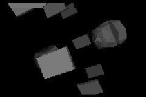
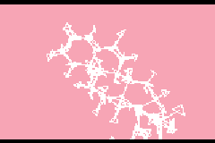

# GeBurtstAg
A tiny [GBA Jam 2021](https://itch.io/jam/gbajam21) *just-for-fun* submission celebrating the 20th anniversary of the [GBA](https://en.wikipedia.org/wiki/Game_Boy_Advance) (*16.7 MHz*!) and other things. It's a small audio-visual demo/toy which uses broken and naive 3D software rendering. 







## How to use
### Dependencies and installation
Requires libtonc (which should come with your devkitARM installation). 

[Apex Audio System](https://github.com/stuij/apex-audio-system) for .mod playback is included in [lib/apex-audio-system](lib/apex-audio-system), you only have to invoke ```make```in that directory, and then you shouldn't have to worry about it anymore. 

You can change the mGBA binary to be used in the top-level [Makefile](Makefile) by changing the path in ```MGBA := /Applications/mGBA.app/Contents/MacOS/mGBA``` to the location of your own local mGBA installation. This way, you can just invoke ```make run```to build and run your code with the correct flags etc.

Also make sure that your ```$(DEVKITARM)```environment is set up correctly. 

We also assume you use mGBA, as assertions and performance monitoring work via *mgba_printf* (see [Credits](CREDITS.md)). 

For code generation and .obj import, you need an installation of *python3* (I think at least 3.6, since we use f-strings etc. extensively; I personally tested with *python 3.9*.)

### Overview

The game-jam specific code, or the actual content, is located in the [source/scenes](source/scenes) directory, while the "engine" (broken rusty bicycle would be a more appropriate description) resides in [source](source) and [source/render](source/render). 

To make something on your own, I'd just look at an existing scene of your liking. You can call ```python3 tools/sceneCodegen.py --new "test" --mode 5```to automatically generate new scene template files called *testScene.c* and *testScene.h* in the [source/scenes](source/scenes) directory, which you can then modify and use to your liking.

If you modify [source/scenes/config](source/scenes/config) by setting another *startscene*, if you remove a scene, or if you add a scene manually, just run ```python3 tools/sceneCodegen.py```without arguments (which then takes care of generating the appropriate code, such as the setup of the appropriate function pointers and *sceneID*s, which allow you to refer/switch between scenes from another scene for instance). 

[source/scene.h](source/scene.h) contains a description on what the functions/function pointers of a scene actually do. 

Note that mode 5 in this broken bicycle actually refers to a scaled and letterboxed version of mode 5. 
(Just pretend mode 5 has a resolution of 160x100 pixels, okay?) More on that in the comments of [source/render/draw.c](source/render/draw.c). You can also use mode 4 (just regular, plain old mode 4 as you know it), but other modes are not implemented yet. Keep in mind that all our 3d drawing code (i.e. the interesting stuff) is only implemented for mode 5 so far, though; but it should be reasonably easy to implement that for mode 4 by changing some constants and logic in [source/render/draw.c](source/render/draw.c), [source/render/rasteriser.h](source/render/rasteriser.h) and [source/camera.c](source/camera.c)  if you desire that. 

For debugging, it might be useful to ```#define USER_SCENE_SWITCH```in [source/scene.c](source/scene.c), which you can use to cycle through scenes with a key sequence (a cheat code essentially). That sequence can be changed in the same file. 


### Asset import
Put your .mod files into [assets/music](assets/music). Just invoking the top-level [Makefile](Makefile) with ```make```will take care of them (look at the examples). 

Put your 3d models into [assets/models](assets/models). As above, just invoke ```make``` (it internally uses ```python3 tools/obj2model.py```to convert your .obj files). You can also use .mtl files (the names must match). So far, multiple objects in one .obj file are treated as one (sorry).

I assume you use blender 2.8 in the following.
Make sure to use the *Principled BSDF* (only its *Base Color* is considered) surface/material type in Blender, as the *Background* (and other) surface types won't be exported. Make sure to triangulate your faces, and make sure you decimate your models (up to 350 triangles might be workable I guess, but the lower, the better). Make sure the *backface-culling* checkbox is checked under the materials (if you want that).

On export in blender, make sure to check *Write Normals*, *Write Materials*, *Triangulate Faces* (if you haven't already with a modifier), and uncheck *Include UVs* (if possible). 

We use instanced models, and organise them in object pools. Pretty unnecessary. In the end, you can just access them through buffers, though. Please look at the example code (I'm in a hurry, sorry). 


## TODO
[There's a lot](TODO.md). It'd be probably better to just start from scratch and let this be. Learned a lot, though!

## License 
All the code which is not owned/licensed under other terms is licensed with *The MIT License (MIT)* [1] (but you *must* respect the respective licenses/restrictions which apply to the work of other people such as credited in [Credits](CREDITS.md)). All assets (music, all 3d models except suzanne.obj and cpa.obj) are licensed under CC BY (Attribution 4.0 International (CC BY 4.0)). [2]

[1] <https://mit-license.org> (last retrieved: 2021-07-10)
>The MIT License (MIT)
>Copyright © 2021 <https://github.com/zeichensystem>
>
>Permission is hereby granted, free of charge, to any person obtaining a copy of this software and associated documentation files (the “Software”), to deal in the Software without restriction, including without limitation the rights to use, copy, modify, merge, publish, distribute, sublicense, and/or sell copies of the Software, and to permit >persons to whom the Software is furnished to do so, subject to the following conditions:
>
>The above copyright notice and this permission notice shall be included in all copies or substantial portions of the Software.
>
>THE SOFTWARE IS PROVIDED “AS IS”, WITHOUT WARRANTY OF ANY KIND, EXPRESS OR IMPLIED, INCLUDING BUT NOT LIMITED TO THE >WARRANTIES OF MERCHANTABILITY, FITNESS FOR A PARTICULAR PURPOSE AND NONINFRINGEMENT. IN NO EVENT SHALL THE AUTHORS OR COPYRIGHT HOLDERS BE LIABLE FOR ANY CLAIM, DAMAGES OR OTHER LIABILITY, WHETHER IN AN ACTION OF CONTRACT, TORT OR OTHERWISE, ARISING FROM, OUT OF OR IN CONNECTION WITH THE SOFTWARE OR THE USE OR OTHER DEALINGS IN THE SOFTWARE.A.

[2] <http://creativecommons.org/licenses/by/4.0/> (last retrieved: 2021-07-10)

## Credits
Based on [a big amount of work of other people.](CREDITS.md) Please respect the licenses of the respective code etc., even if the rest of this repository is licensed under aforementioned *MIT License (MIT)*.   
